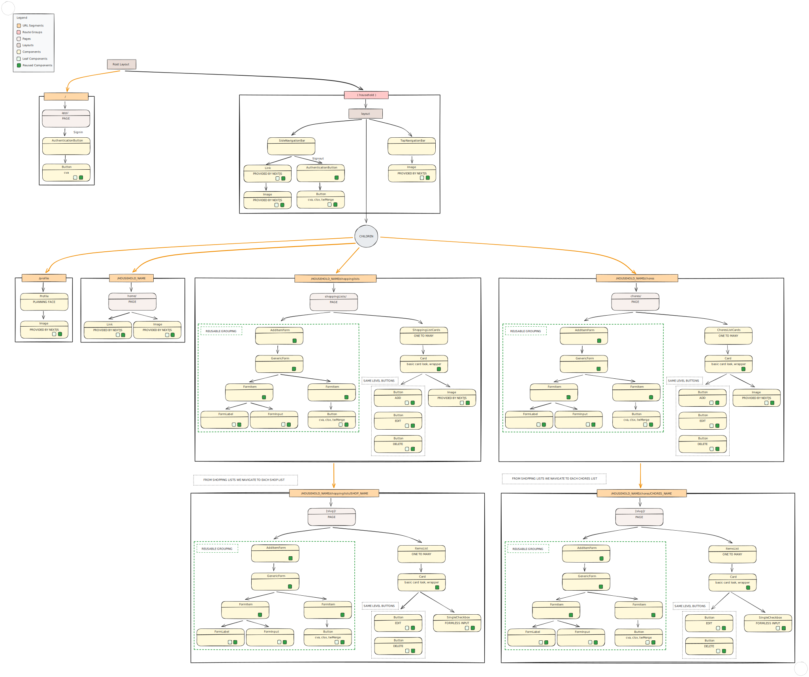

# Components Tree

All the project components designs and how they related to each other.

## The Folder Structure

- ✅ app/
  - ✅ RootLayout.tsx
  - ✅ page.tsx _LoginPage component_
  - ✅ _components/
    - ✅ form/
      - ✅ FormItem.tsx
      - ✅ FormLabel.tsx
      - ✅ GenericForm.tsx
      - ✅ InputField.tsx
    - ✅ AuthenticationButton.tsx
    - ✅ Button.tsx
    - ✅ Card.tsx
    - ✅ SieNavigationBar.tsx
    - ✅ TopNavigationBar.tsx
    - AddItemForm.tsx _used by ShoppingLists, ShoppingListItems, Chores, ChoreItems_
  - ✅ (household) _protected route_
    - ✅ layout.tsx _shows menu for authd users_
    - ✅ home/ _ROUTE SEGMENT_
      - ✅ page.tsx
    - profile/ _ROUTE SEGMENT_
      - page.tsx
    - ✅ shoppingLists/ _ROUTE SEGMENT_
      - ✅ page.tsx
      - shoppingListCards.tsx _maps through the shopping lists to display each list_
      - [shoppingListName]/ _dynamically displays the name of the shop in the url_
        - page.tsx
        - itemsList.tsx
    - ✅ chores/ _ROUTE SEGMENT_
      - ✅ page.tsx
      - ChoresListCards.tsx
      - [slug]/ _dynamically displays the list name in the url_
        - page.tsx
        - ItemsList.tsx

## The Visual Tree

