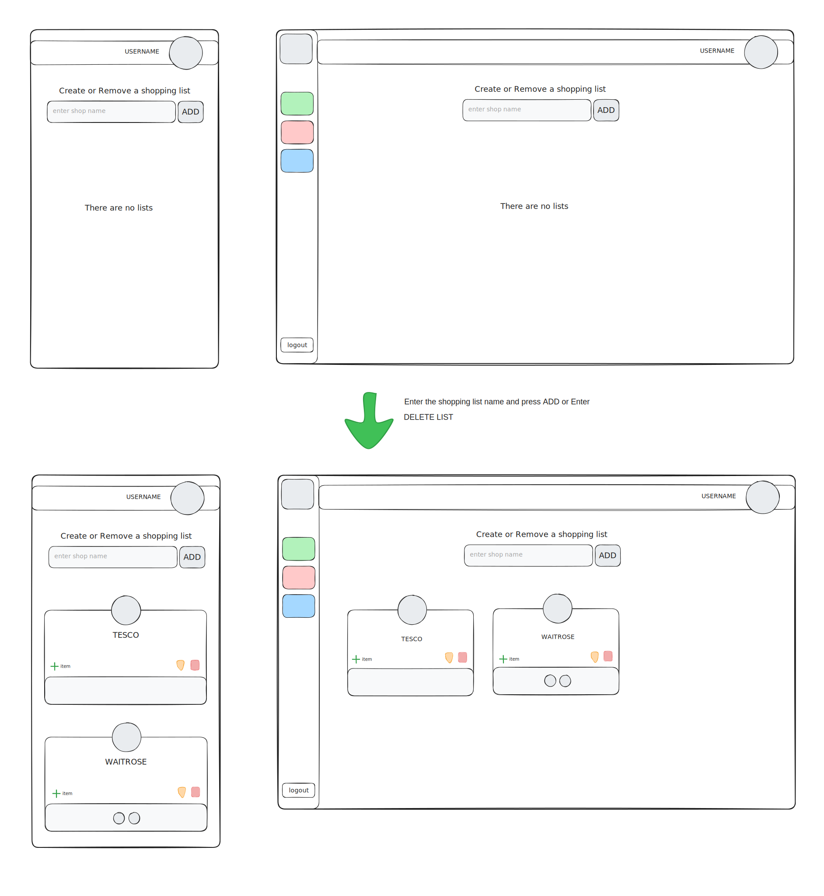
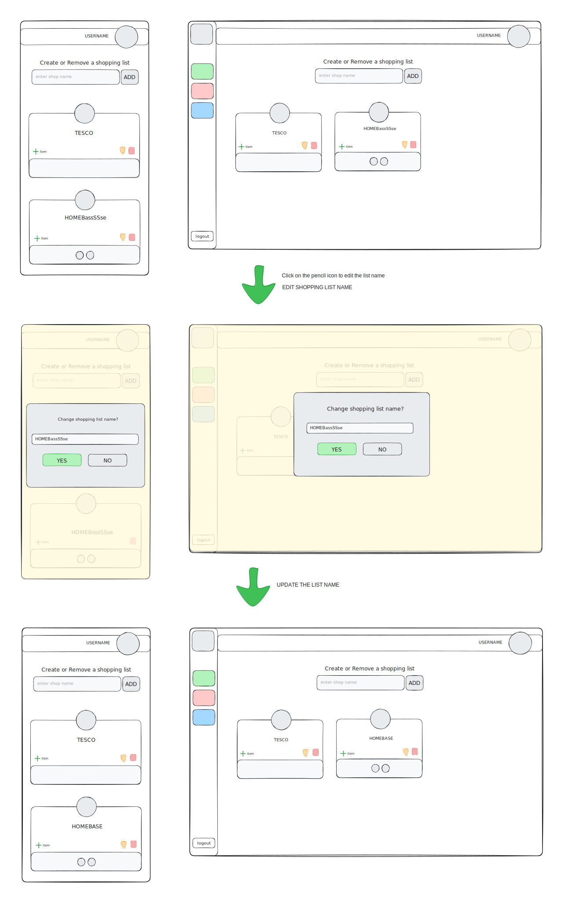
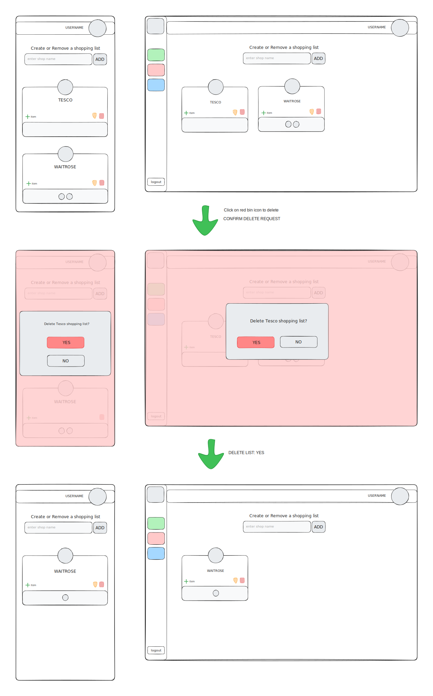
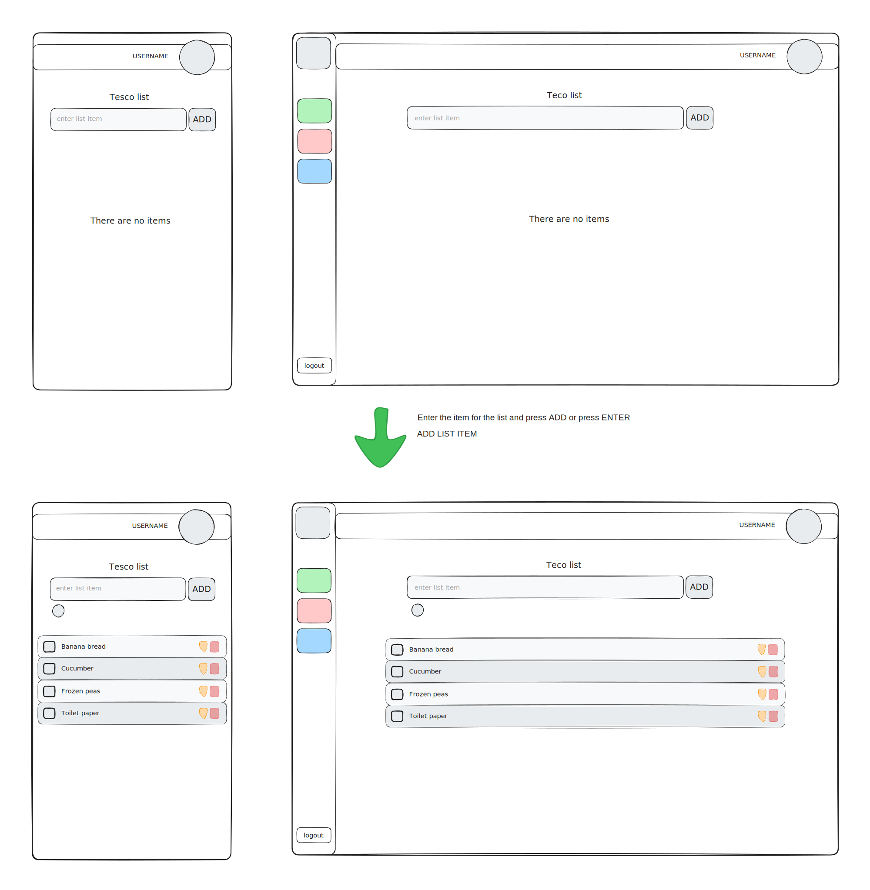
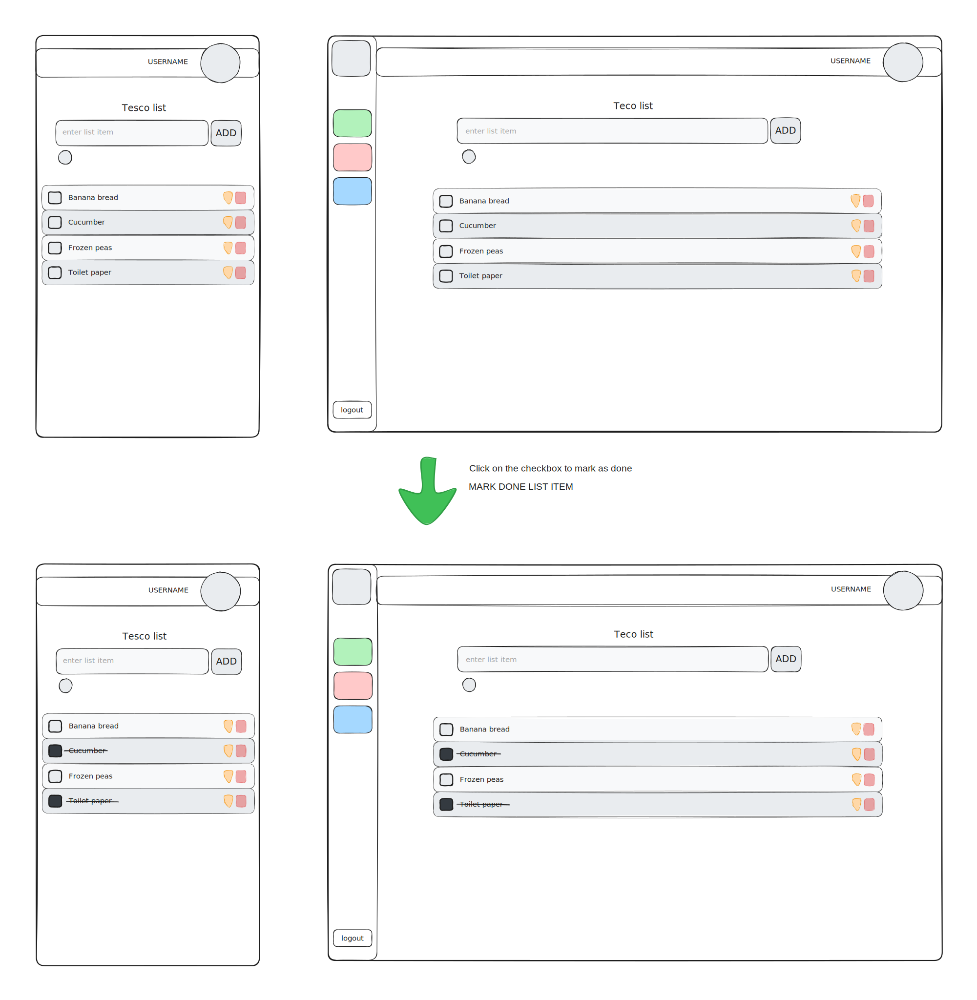
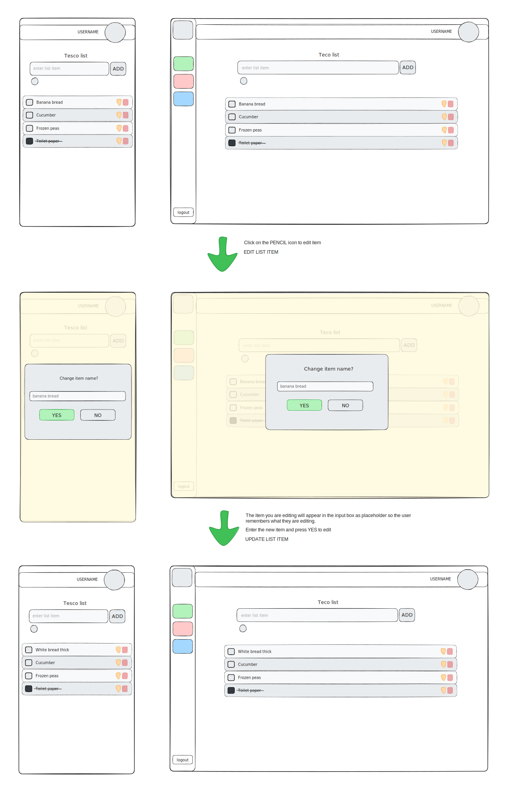
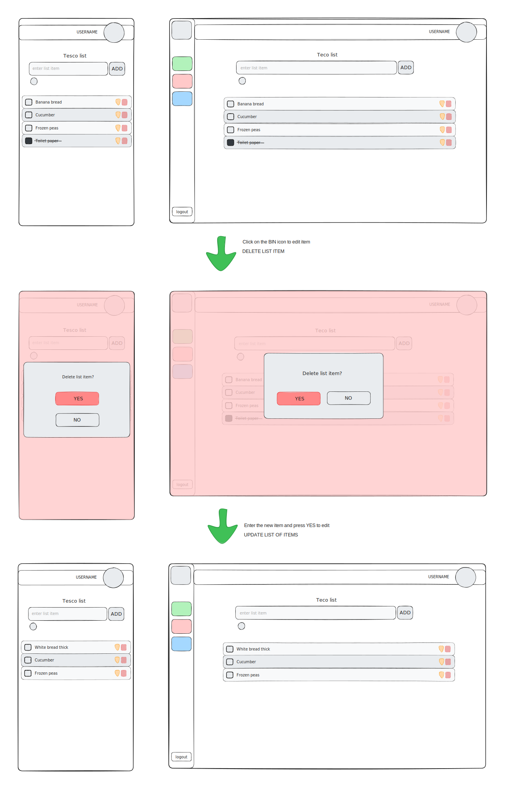

# Shopping List

The wireframes for the shopping list feature.

## Table of contents

- [Shopping list](#shopping-list)
  - [Create a shopping list](#create-a-shopping-list)
  - [Edit a shopping list](#edit-a-shopping-list-name)
  - [Delete a shopping list](#delete-a-shopping-list)
- [Shopping list items](#shopping-list-items)
  - [Add list items](#add-list-items)
  - [Mark list items as done](#mark-list-items-as-done)
  - [Edit list items](#edit-list-items)
  - [Delete list items](#delete-list-items)

## Shopping list

### Create a shopping list

### Edit a shopping list name

### Delete a shopping list

## Shopping list items

### Add list items

### Mark list items as done

### Edit list items

### Delete list items

