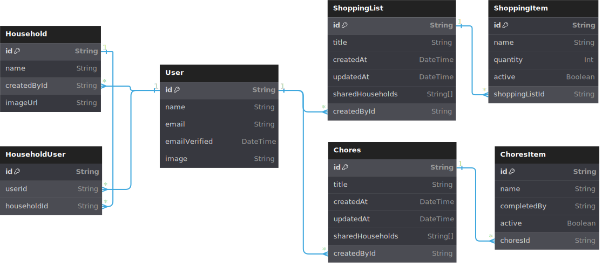
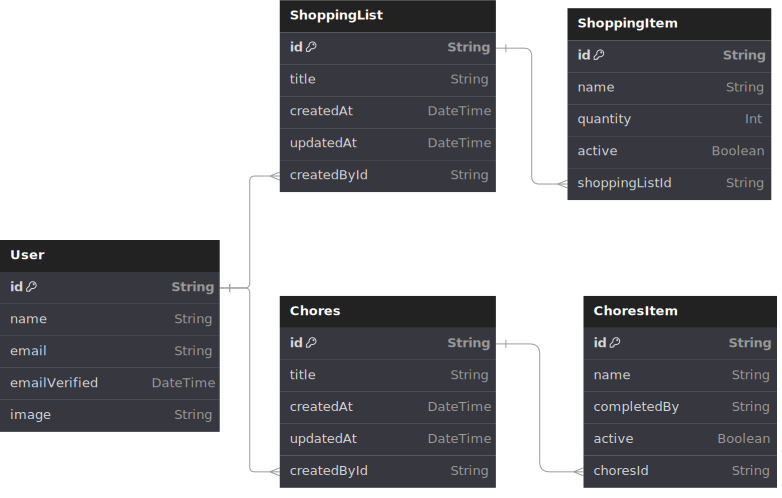

# Designs for all Relationship modals

The prisma schema supports [models](https://www.prisma.io/docs/orm/prisma-schema/data-model/models) from which mondoDB can build collections with relationships.

## Table of contents

- [Full User Modal](#full-user-modal)
- [User with full shopping and chores modals](#user-with-shopping-and-chores)

### Full User Modal

### User with shopping and chores modals()

### User with Shopping and Chores

