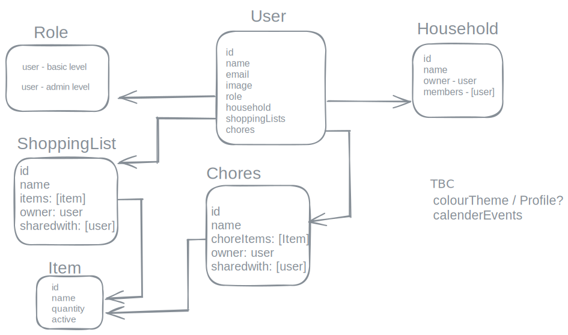

# Design for User and Household modals

The prisma schema supports [models](https://www.prisma.io/docs/orm/prisma-schema/data-model/models) from which mondoDB can build collections with relationships.

# Entity relationship diagram

