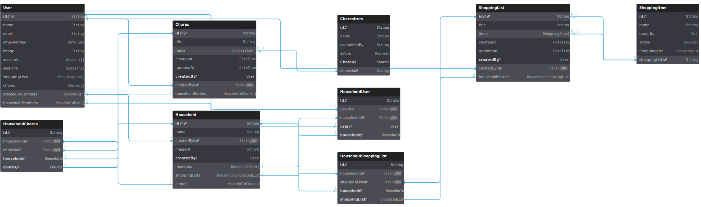

# Design for User and Household modals

https://dbdiagram.io/d/669ac6f48b4bb5230ed6c967 used to model prisma database schema written in DBML syntax:

# Entity relationship diagrams



```tsx

Table User {
  id                String [pk, note: "Mapped to _id"]
  name              String
  email             String [unique]
  emailVerified     DateTime
  image             String

  Note: "User model can be updated as the application grows"
}

Table ShoppingList {
  id        String [pk, note: "Mapped to _id"]
  title     String
  createdAt DateTime [default: `now()`]
  updatedAt DateTime [default: `updatedAt`]

  createdById String [ref: > User.id]

  Indexes {
    title
  }
}

Table ShoppingItem {
  id             String [pk, note: "Mapped to _id"]
  name           String
  quantity       Int
  active         Boolean
  shoppingListId String [ref: > ShoppingList.id]
}

Table Chores {
  id        String [pk, note: "Mapped to _id"]
  title     String
  createdAt DateTime [default: `now()`]
  updatedAt DateTime [default: `updatedAt`]

  createdById String [ref: > User.id]

  Indexes {
    title
  }

  Note: "Chores model can be updated as the application grows"
}

Table ChoresItem {
  id          String [pk, note: "Mapped to _id"]
  name        String
  completedBy String
  active      Boolean
  choresId    String [ref: > Chores.id]
}

Table Household {
  id          String [pk, note: "Mapped to _id"]
  name        String
  createdById String [ref: > User.id]
  imageUrl    String
}

Table HouseholdUser {
  id          String [pk, note: "Mapped to _id"]
  userId      String [ref: > User.id]
  householdId String [ref: > Household.id]

  Indexes {
    (userId, householdId) [unique]
  }
}
```